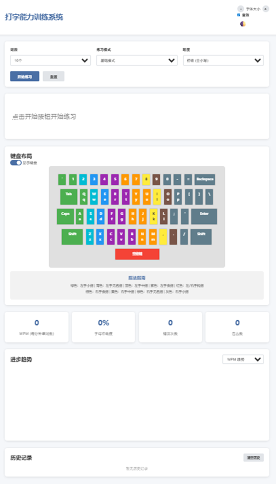
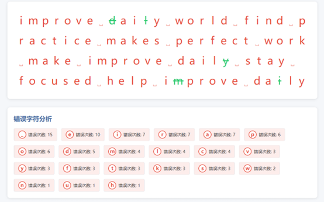
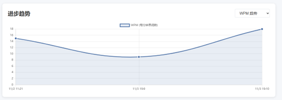
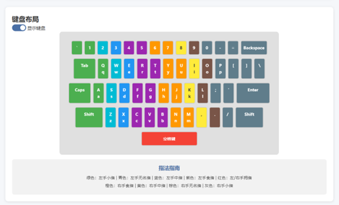

# 打字能力训练系统 | Typing Practice System
一款基于原生前端技术开发的纯静态打字练习工具，整合多模式训练、实时数据反馈与个性化设置，无需联网即可使用，助力用户从入门到进阶系统提升打字速度与准确率 🚀


## 🌟 项目核心亮点
- 🔹 **多场景练习模式**：基础模式（固定词数）、计时模式（60/120秒限时）、自定义模式（支持导入任意文本），适配新手入门到专业提升需求  
- 🔹 **三级难度梯度**：初级（全小写字母）→ 中级（大小写+数字）→ 高级（标点+特殊字符），循序渐进强化技能  
- 🔹 **全维度数据反馈**：实时显示WPM（每分钟单词数）、准确率、错误次数、连击数，练习效果直观可见  
- 🔹 **针对性短板分析**：练习结束后自动统计高频错误字符，生成改进建议，避免盲目训练  
- 🔹 **沉浸式辅助功能**：可视化键盘布局+标准指法指南（颜色标注手指分工），新手快速掌握盲打  
- 🔹 **个性化体验**：浅色/深色主题切换、1.0-3.0rem字体调节、音效开关，适配不同使用环境与习惯  
- 🔹 **轻量离线特性**：无框架依赖，克隆后直接打开即可运行；数据存储于localStorage，保障隐私安全  


## 📸 功能演示（直接显示图片）
### 1. 主界面与基础设置
  
（说明：主界面包含练习模式选择、难度设置、个性化开关，支持一键启动练习）

### 2. 练习过程实时反馈
  
（说明：绿色=正确输入，红色=错误输入，高亮=当前待输入字符；实时显示WPM、准确率、连击数）

### 3. 数据统计与错误分析
  
（说明：练习结束后展示错误字符统计、进步趋势图表，支持查看历史记录对比）

### 4. 键盘布局与指法指南
  
（说明：颜色标注手指分工，新手快速熟悉键位，助力盲打入门）

> 提示：所有图片均存储在仓库的`screenshots`文件夹中，直接在README渲染，无需点击链接。

## 🚀 快速开始
### 1. 克隆仓库
```bash
# 克隆项目到本地
git clone https://github.com/daodiaoren-tlh/-.git

# 进入项目目录
cd -